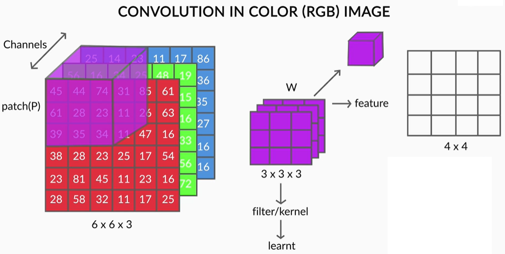

## Introduction to Convolutional Neural Networks

### Introduction
Welcome to the module on **Convolutional Neural Networks**.

Convolutional Neural Networks, or CNNs, are neural networks specialised to work with **visual data**, i.e. images and videos (though not restricted to them). They are very similar to the vanilla neural networks (multilayer perceptrons) - every neuron in one layer is connected to every neuron in the next layer, they follow the same general principles of forward and backpropagation, etc. However, there are certain features of CNNs that make them perform extremely well on image processing tasks. 

By the end of this module, you will be able to understand the working principles of CNNs, compare various CNN architectures and be able to choose the right architecture for specific tasks. In **transfer learning**, you will learn to use large pre-trained networks for your own computer vision tasks. You will also be able to train CNNs using Python + Keras.4

### A Specialised Architecture for Visual Data
Convolutional Neural Networks, or CNNs, are specialised architectures which work particularly well with visual data**, i.e. images and videos. They have been largely responsible for revolutionalizing 'deep learning' by setting new benchmarks for many **image processing** tasks that were very recently considered extremely hard.

Let's start by understanding some common challenges in image processing.

### Challenges in Image Processing
Let's consider the common task of **visual recognition** (like identifying a ‘cat’ or a ‘dog’) - trivial as it is for humans, it is still a big challenge for algorithms. Let’s look at some of the challenges:

* Viewpoint variation: Different orientations of the image with respect to the camera.

* Scale variation: Different sizes of the object with respect to the image size.

* Illumination conditions: Illumination effects.

* Background clutter: Varying backgrounds.

### CNNs - A Specialised Architecture for Visual Data
Although the vanilla neural networks (MLPs) can learn extremely complex functions, their architecture does not exploit what we know about how the brain reads and processes images. For this reason, although MLPs are successful in solving many complex problems, they haven't been able to achieve any major breakthroughs in the image processing domain.    

On the other hand, the architecture of CNNs uses many of the working principles of the **animal visual system** and thus they have been able to achieve extraordinary results in image-related learning tasks. 

### The ImageNet Challenge
CNNs had first demonstrated their extraordinary performance in the **ImageNet Large Scale Visual Recognition Challenge (ILSVRC)**.  The ILSVRC uses a list of about 1000 image categories or "classes" and has about 1.2 million training images. The original challenge is an **image classification task**.

You can see the impressive results of CNNs in the ILSVRC where they now outperform humans (having 5% error rate). The error rate of the ResNet, a recent variant in the CNN family, is close to 3%.

In the next segment, you will study the different ways in which CNNs are used for image-processing tasks.

### Applications of CNNs
In this segment, we will study some common **types of image processing tasks** which can be solved using CNNs. 

Some applications that we have discussed are:
* **Object localization** -Identifying the local region of the objects (as a rectangular area) and classifying them.

* **Semantic segmentation**: Identifying the exact shapes of the objects (pixel by pixel) and classifying them.

* **Optical Character Recognition (OCR)**: Recognise characters in an image. For e.g. for the top-left image, the output will be ‘1680’.

There are various other applications of CNNs in the healthcare sector. Many medical imaging applications used in radiology, cardiology, gastroenterology etc. involve classification, detection, and segmentation of objects which can be analysed using CNNs. 

 In the next segment, you will study the motivation behind CNNs' architecture coming from the **visual system of mammals**. 

 ### Understanding the Visual System of Mammals - I
 We had mentioned that the architecture of CNNs is motivated by the **visual system of mammals**. In this segment, we will discuss an influential paper named [“Receptive field for single neurons in the cat’s striate cortex”](https://www.ncbi.nlm.nih.gov/pmc/articles/PMC1363130/pdf/jphysiol01298-0128.pdf) published by **Hubel and Wiesel**.

 This was basically a bunch of experiments conducted to understand the visual system of a cat. In the experiments, spots of light (of various shapes and size) were made to fall on the retina of a cat and, using an appropriate mechanism, the response of the **neurons in the cat's retina** was recorded. This provided a way to observe which types of spots make some particular neurons 'fire', how groups of neurons respond to spots of certain shapes, etc.

 Let’s look at some of the statements made in this paper.

Some of the important observations made in the study were:
* Each neuron in the retina focuses on one part of the image and that part of the image is called the **receptive field of that neuron**.
* There are **excitatory and inhibitory regions** in the receptive field. The neurons only ‘fire’ when there is a **contrast between the excitatory and the inhibitory regions**. If we splash light over the excitatory and inhibitory regions together, because of no contrast between them, the neurons don’t ‘fire’ (respond). If we splash light just over the excitatory region, neurons respond because of the contrast.

The figure below shows a certain region of the receptive field of a cat. The excitatory region (denoted by the triangular marks) is at the centre surrounded by the inhibitory region marked by the crosses.

* The **strength of the response** is proportional to the summation over only the excitatory region (not inhibitory region). Later, we will study the **pooling layer in CNNs** which corresponds to this observation.

In the next segment, we will study some more observations from this study that influenced the CNN architecture.

### Understanding the Visual System of Mammals -II
You have already seen that every neuron is trained to look at a particular patch in the retina, called the **receptive field** of that neuron.

This raises some questions such as: Are the shapes and sizes of these receptive fields identical across neurons or do they vary? Do all the neurons 'see' the same 'features', or are some neurons specialised to 'see' certain features?

Let's seek answers to some of these questions. You will also study, at a high level, how higher-level abstract 'features' such as 'movement’ are detected by the visual system.

The two main observations from the paper:
* The **receptive fields of all neurons are almost identical** in shape and size
* There is a **hierarchy in the units**: Units at the initial level do very basic tasks such as picking raw features (such as horizontal edges) in the image. The subsequent units extract more abstract features, such as identifying textures, detecting movement, etc. The layers 'higher' in the hierarchy typically **aggregate the features** in the lower ones.

The image below illustrates the hierarchy in units  - the first level extracts low-level features (such as vertical edges) from the image, while the second level calculates the statistical aggregate of the first layer to extract higher-level features (such as texture, colour schemes etc.).

Using this idea, if we design a complex network with multiple layers to do **image classification** (for example), the layers in the network should do something like this:
* The first layer extracts raw features, like vertical and horizontal edges
* The second layer extracts more abstract features such as textures (using the features extracted by the first layer)
* The subsequent layers may identify certain parts of the image such as skin, hair, nose, mouth etc. based on the textures.
* Layers further up may identify faces, limbs etc. 
* Finally, the last layer may classify the image as 'human', 'cat' etc.

Apart from explaining the visual system, the paper also suggested that similar phenomena have been observed in the **auditory system** and touch and pressure in the **somatosensory system**. This suggests that CNN-like architectures can be used for **speech processing** and analysing signals coming from **touch sensors** or **pressure sensors** as well. 

Let's have a look at some of the conclusions.

We have already discussed most of the key ideas of the CNN architecture through this paper. Summarising the main points below:
* Each unit, or neuron, is dedicated to its own **receptive field**. Thus, every unit is meant to ignore everything other than what is found in its own receptive field.
* The **receptive field** of each neuron is almost identical in shape and size.
* The subsequent layers compute the **statistical aggregate** of the previous layers of units. This is analogous to the 'pooling layer' in a typical CNN.
* Inference or the perception of the image happens at various **levels of abstraction**. The first layer pulls out raw features, subsequent layers pull out higher-level features based on the previous features and so on. Finally, the network gets an overall perception of an image in the last layer.

### Introduction to CNNs
Let's dig a little deeper into CNN architectures now. In this segment, we will analyse the architecture of a popular CNN called **VGGNet**. Observing the VGGNet architecture will give you a high-level overview of the common types of CNN layers before you study each one of them in detail.

The VGGNet architecture is shown below.

The VGGNet was specially designed for the ImageNet challenge which is a classification task with 1000 categories. Thus, the softmax layer at the end has 1000 categories. The blue layers are the **convolutional layers** while the yellow ones are **pooling layers**. You will study each one of them shortly.

Finally, the green layer is a **fully connected layer** with 4096 neurons, the output from which is a vector of size 4096.

The most important point to notice is that the **network acts as a feature extractor** for images. For example, the CNN above extracts a **4096-dimensional feature vector** representing each input image. In this case, the feature vector is fed to a softmax layer for classification, but you can use the feature vector to do other tasks as well (such as video analysis, object detection, image segmentation etc.).

Next, you will see how one can do **video analysis** using the feature vector extracted by the network.

To summarise, there are three main concepts you will study in CNNs:
* Convolution, and why it 'shrinks' the size of the input image
* Pooling layers
* Feature maps

### Reading Digital Images
Before we dig deeper into the architecture of CNNs, let's understand what images are and how they are fed into CNNs.

You already know that the input to any neural network should be numeric. Fortunately, images are naturally represented as arrays (or matrices) of numbers. Let's study the typical structure of images.

To summarize:
* Images are made up of **pixels**.
* A number between 0-255 represents the **colour intensity** of each pixel.
* Each pixel in a **colour image** is an array representing the intensities of red, blue and green. The red, blue and green layers are called **channels**.

In a **grayscale image** (a 'black and white' image), only one number is required to represent the **intensity of white**. Thus, grayscale images have **only one channel**.  

Now that you know that images can be represented as numbers, let’s see an example of how one would read images into Python.

You can download the notebook below. 

[Reading Digital Images](dataset/Reading_Digital_Image.iynb)

Let’s summarise the important points. Consider this sample image of a 'zero' from the MNIST dataset.

* The height and width of this image are 18 pixels, so it is stored as an 18 x 18 array
* Each pixel's value lies between 0-255
* The pixels having a value close to 255 appear white (since the pixels represent the intensity of white), and those close to 0 appear black

Let’s see this for a colour image.

* The height and width of the image are 4 pixels.
* Here, three numbers make each pixel (representing RGB). So, there are 3 channels here.
* The size of the matrix is thus 4 x 4 x 3

Note that all colours can be made by mixing red, blue and green at different degrees of “saturation” (0-100% intensity). For example, a pure red pixel has 100% intensity of red, and 0% intensity of blue and green. So, it is represented as (255,0,0). White is the combination of 100% intensity of red, green and blue. So, it is represented as (255,255,255).

**Why is the Range of Pixel Values 0-255?**

Let's now quickly summarise what you have learnt about images.

### Video Analysis
In this segment, you will understand the process of **video analysis using CNNs**. A video is basically a sequence of frames where each frame is an image. You already know that CNNs can be used to extract features from an image. Let's now see how CNNs can be used to process a series of images (i.e. videos). 

Let's summarise the process of video analysis using a CNN + RNN (Recurrent Neural Network) stack. At this point, you only need to understand that RNNs are good at processing sequential information such as videos (a sequence of images), text (a sequence of words or sentences), etc. You will study RNN in the next module. 

For a **video classification** task, here's what we can do. Suppose the videos are of length 1 minute each. If we extract frames from each video at the rate of **2 frames per second** (FPS), we will have 120 frames (or images) per video. Push each of these images into a convolutional net (such as VGGNet) and **extract a feature vector** (of size 4096, say) for each image. Thus, we have 120 feature vectors representing each video. 

These 120 feature vectors, representing a video as a sequence of images, can now be fed sequentially into an RNN which classifies the videos into one of the categories.

The main point here is that a **CNN acts as a feature extractor** for images, and thus, can be used in a variety of ways to process images.

In the next few segments, you will study the main elements of CNNs in detail - convolutions, pooling, feature maps etc.

### Understanding Convolutions - I
We had mentioned three main terminologies related to the CNN architecture:
* Convolutions
* Pooling 
* Feature Maps
 
 In the next few segments, we will go through each one of them in detail. Let's start by understanding how convolutions work.

### Convolution
Mathematically, the convolution operation is the **summation of the element-wise product** of two matrices. Let’s take two matrices, X and Y. If you 'convolve the image X using the filter Y', this operation will produce the matrix Z. 

### Understanding Convolutions - II
Now, that you have understood the basic idea of filters and convolutions, let's continue our example from the previous page to understand how convolutions are used to **detect features** (such as vertical or horizontal edges) in an image.

This was an example of how the convolution operation (using an appropriate filter) detects certain features in images, such as horizontal or vertical edges.

In the convolution output using the first filter, only the middle two columns are nonzero while the two extreme columns (1 and 4) are zero. This is an example of **vertical edge detection**.  

Note that each column of the 4 x 4 output matrix looks at exactly three columns of the input image. The values in the four columns represent the amount of change (or gradient) in the intensity of the corresponding columns in the input image along the horizontal direction.

For e.g. the output is 0 (20 - 20 or 10 - 10) in the columns 1 and 4, denoting that there is no change in intensity in the first three and the last three columns of the input image respectively.

On the other hand, the output is 30 (20 - (-10)) in the columns 2 and 3, indicating that there is a gradient in the intensity of the corresponding columns of the input image.

### Other Filters
The filter below is used for **horizontal edge detection**. Convince yourself that this filter will be able to detect horizontal edges in an image.

Although we have only seen very simple filters, one can design arbitrarily complex filters for detecting edges and other patterns. For example, the image below shows **the Sobel filter** which can detect both horizontal and vertical edges in complex images. 

We have discussed some simple examples of filters and convolutions, and you may have some questions such as 'can filters have arbitrary sizes', 'can any filter convolve any image', etc. In the next segment, we will be able to answer these questions using the concepts of **stride** and **padding**.

### Stride and Padding
In the previous segment, while doing convolutions, each time we computed the element-wise product of the filter with the image, we had moved the filter by exactly one pixel (both horizontally and vertically). But that is not the only way to do convolutions - you can move the filter by an arbitrary number of pixels. This is the concept of **stride**.

Let's study strides in a little more detail. The notion of strides will also introduce us to another important concept - **padding**.

You saw that there is nothing sacrosanct about the stride length 1. If you think that you do not need many fine-grained features for your task, you can use a higher stride length (2 or more).

You also saw that you cannot convolve all images with just any combination of filter and stride length. For example, you cannot convolve a (4, 4) image with a (3, 3) filter using a stride of 2. Similarly, you cannot convolve a (5, 5) image with a (2, 2) filter and a stride of 2 (try and convince yourself). 

To solve this problem, you use the concept of **padding**.

### Padding
The following are the two most common ways to do padding:
* Populating the dummy row/columns with the pixel values at the edges
* Populating the dummy row/columns with zeros (zero-padding)

Notation:  
**Padding of 'x' means that 'x units' of rows/columns are added all around the image.**

An alternate (less commonly used) way to do convolution is to shrink the filter size as you hit the edges. 

You may have noticed that when you convolve an image **without padding** (using any filter size), the **output size is smaller** than the image (i.e. the output **'shrinks'**). For e.g. when you convolve a (6, 6) image with a (3, 3) filter and stride of 1, you get an output of (4, 4). 

If you want to **maintain the same size**, you can use padding. Let's see how padding maintains the image size.

You saw that doing convolutions without padding **reduces the output size**. It is important to note that **only the width and height decrease (not the depth)** when you convolve without padding.  The depth of the output depends on the number of filters used -  we will discuss this in a later segment.

### Why Padding is Necessary

You saw that doing convolutions without padding will 'shrink' the output. For e.g. convolving a (6, 6) image with a (3, 3) filter and stride of 1 gives a (4, 4) output. Further, convolving the (4, 4) output with a (3, 3) filter will give a (2, 2) output. The size has reduced from (6, 6) to (2, 2) in just two convolutions. Large CNNs have tens (or even hundreds) of such convolutional layers (recall VGGNet), so we will be incurring massive 'information loss' as we build deeper networks!

This is one of the main reasons padding is important - it helps maintain the size of the output arrays and avoid information loss. Of course, in many layers, you actually want to shrink the output (as shown below), but in many others, you maintain the size of the output.

Until now, you have been computing the output size (using the input image size, padding and stride length) manually. In the next segment, you will learn generic formulas which will help reduce some of the manual work that you have been doing.

### Important Formulas
In this segment, you will go through useful formulas for calculating the output size using the input size, filter size, padding and stride length. 

**Fun Challenge**  
Before moving on to the segment, you may want to try solving this problem yourself first: Given an image of size (n, n), a (k, k) filter, padding of p pixels on either side of the image, and stride length of S,  derive a general formula for computing the output size after convolution.

### Weights of a CNN
So far, we have been doing convolutions only on 2D arrays (images), say of size 6x6. But most real images are coloured (RGB) images and are 3D arrays of size m x n x 3. Generally, we represent an image as a 3D matrix of size **height x width x channels**.

To convolve such images, we simply use **3D filters**. The basic idea of convolution is still the same - we take the element-wise product and sum up the values. The only difference is that now the filters will be 3-dimensional, for e.g. 3 x 3 x 3, or 5 x 5 x 3 (the last '3' represents the fact that the filter has as many channels as the image). 

Let's now see how convolutions are performed on 3D arrays and what it is that a CNN 'learns' during **training**.

To summarise, you learnt that:
* We use **3D filters** to perform convolution on 3D images. For e.g. if we have an image of size (224, 224, 3), we can use filters of sizes (3, 3, 3), (5, 5, 3), (7, 7, 3) etc. (with appropriate padding etc.). We can use a filter of any size as long as the number of channels in the filter is the same as that in the input image.
* The **filters are learnt** during training (i.e. during backpropagation). Hence, the individual values of the filters are often called the **weights of a CNN**.

### Comprehension - Weights and Biases 
In the discussion so far, we have talked about only weights, but convolutional layers (i.e. filters) also have **biases**. Let's see an example to understand this concretely.

Suppose we have an RGB image and a (2, 2, 3) filter as shown below. The filter has three channels, and each channel of the filter convolves the corresponding channel of the image. Thus, each step in the convolution involves the element-wise multiplication of 12 pairs of numbers and adding the resultant products to get a **single scalar output**.

The gif below shows the convolution operation - note that in each step, a single scalar number is generated, and at the end of the convolution, a 2D array is generated:

In the next segment, we will study **feature maps**.

### Feature Maps
From the previous segment, you know that the values of the filters, or the weights, are learnt during training. Let's now understand how multiple filters are used to detect various features in images. In this lecture, you will study **neurons** and **feature maps**.

Let's summarise the important concepts and terms discussed above: 
* A **neuron** is basically a filter whose weights are learnt during training. For example, a (3, 3, 3) filter (or neuron) has 27 weights. Each neuron looks at a particular region in the input (i.e. its 'receptive field').
* A **feature map** is a collection of multiple **neurons** each of which looks at **different regions** of the input with the **same weights**. All neurons in a feature map extract the same feature (but from different regions of the input). It is called a 'feature map' because it is a mapping of where a certain feature is found in the image. 

The figure below shows two neurons in a feature map (the right slab) along with the regions in the input from which the neurons extract features. 

In the figure above, the two neurons produce two feature maps. You can have multiple such neurons convolve an image, each having a different set of weights, and each produces a feature map.

### Comprehension - Feature Maps
Consider the VGGNet architecture shown below. The first convolutional layer takes the input image of size (224, 224, 3), uses a (3, 3, 3) filter (with some padding), and produces an output of (224, 224). This (224, 224) output is then fed to a **ReLU** to generate a (224, 224) **feature map**. Note that the term 'feature map' refers to the (non-linear) *output of the activation function**, not what goes into the activation function (i.e. the output of the convolution).

Similarly, multiple other (224, 224) feature maps are generated using different (3, 3, 3) filters. In the case of VGGNet, 64 feature maps of size (224, 224) are generated, which are denoted in the figure below as the tensor 224 x 224 x 64. Each of the 64 feature maps try to identify certain features (such as edges, textures etc.) in the (224, 224, 3) input image.

The (224, 224, 64) tensor is the output of the first convolutional layer.  In other words, the first convolutional layer consists of 64 (3, 3, 3) filters, and hence contains 64 x 27 trainable weights (assuming there are no biases).

The 64 feature maps, or the (224, 224, 64) tensor, is then fed to a **pooling layer**. You will study the pooling layer in the next segment.

### Pooling
In our earlier discussion on the experiments by Hubel and Wiesel, we had observed the following statement:
* The strength of the response (of the retinal neurons) is proportional to the **summation** over the excitatory region. 

After extracting features (as feature maps), CNNs typically **aggregate these features** using the pooling layer. Let's see how the pooling layer works and how it is useful in extracting higher-level features.

Pooling tries to figure out whether a particular region in the image has the feature we are interested in or not. It essentially looks at larger regions (having multiple patches) of the image and captures an **aggregate statistic** (max, average etc.) of each region. In other words, it makes the network **invariant to local transformations**.

The two most popular aggregate functions used in pooling are 'max' and 'average'. The intuition behind these are as follows:
* **Max pooling**: If any one of the patches says something strongly about the presence of a certain feature, then the pooling layer counts that feature as 'detected'.
* **Average pooling**: If one patch says something very firmly but the other ones disagree,  the pooling layer takes the average to find out.

Let's now look at an example of max pooling and understand some potential drawbacks of the pooling operation.

In the above figure, you can observe that only the width and height of the input reduces. Let's extend this pooling operation to multiple feature maps:

You can observe that pooling operates on each feature map independently. It reduces the size (width and height) of each feature map, but the number of feature maps remains constant. 

Pooling has the advantage of making the representation more compact by **reducing the spatial size** (height and width) of the feature maps, thereby reducing the number of parameters to be learnt. On the other hand, it also **loses a lot of information**, which is often considered a potential disadvantage. Having said that, pooling has empirically proven to improve the performance of most deep CNNs.

Can we design a network without pooling? **Capsule networks** were designed to address some of these potential drawbacks of the conventional CNN architecture. The paper on Capsule networks  is provided below.

In the next segment, we will summarise all the concepts discussed till now.

**Additional Reading**
1. The paper on ['Capsule Networks'](https://arxiv.org/pdf/1710.09829.pdf). 

### Putting the Components Together
You have now studied all the main components of a typical CNN - convolutions, feature maps, pooling layers etc. Let’s now quickly summarise and put them together to get an overall picture of CNNs' architecture. 

To summarise, a **typical CNN layer (or unit)** involves the following **two components** in sequence:
* We start with an original image and do convolutions using multiple filters to get multiple feature maps.
* A pooling layer takes the statistical aggregate of the feature maps

Typically, deep CNNs have **multiple such CNN units** (i.e. feature map-pooling pairs) arranged sequentially. The following lecture will discuss this in detail.

