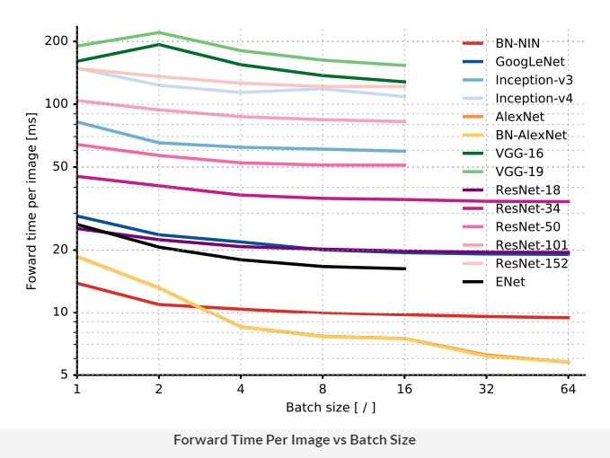

## Introduction to Convolutional Neural Networks

### Introduction
Welcome to the module on **Convolutional Neural Networks**.

Convolutional Neural Networks, or CNNs, are neural networks specialised to work with **visual data**, i.e. images and videos (though not restricted to them). They are very similar to the vanilla neural networks (multilayer perceptrons) - every neuron in one layer is connected to every neuron in the next layer, they follow the same general principles of forward and backpropagation, etc. However, there are certain features of CNNs that make them perform extremely well on image processing tasks. 

By the end of this module, you will be able to understand the working principles of CNNs, compare various CNN architectures and be able to choose the right architecture for specific tasks. In **transfer learning**, you will learn to use large pre-trained networks for your own computer vision tasks. You will also be able to train CNNs using Python + Keras.4

### A Specialised Architecture for Visual Data
Convolutional Neural Networks, or CNNs, are specialised architectures which work particularly well with visual data**, i.e. images and videos. They have been largely responsible for revolutionalizing 'deep learning' by setting new benchmarks for many **image processing** tasks that were very recently considered extremely hard.

Let's start by understanding some common challenges in image processing.

### Challenges in Image Processing
Let's consider the common task of **visual recognition** (like identifying a ‘cat’ or a ‘dog’) - trivial as it is for humans, it is still a big challenge for algorithms. Let’s look at some of the challenges:

* Viewpoint variation: Different orientations of the image with respect to the camera.

* Scale variation: Different sizes of the object with respect to the image size.

* Illumination conditions: Illumination effects.

* Background clutter: Varying backgrounds.

### CNNs - A Specialised Architecture for Visual Data
Although the vanilla neural networks (MLPs) can learn extremely complex functions, their architecture does not exploit what we know about how the brain reads and processes images. For this reason, although MLPs are successful in solving many complex problems, they haven't been able to achieve any major breakthroughs in the image processing domain.    

On the other hand, the architecture of CNNs uses many of the working principles of the **animal visual system** and thus they have been able to achieve extraordinary results in image-related learning tasks. 

### The ImageNet Challenge
CNNs had first demonstrated their extraordinary performance in the **ImageNet Large Scale Visual Recognition Challenge (ILSVRC)**.  The ILSVRC uses a list of about 1000 image categories or "classes" and has about 1.2 million training images. The original challenge is an **image classification task**.

You can see the impressive results of CNNs in the ILSVRC where they now outperform humans (having 5% error rate). The error rate of the ResNet, a recent variant in the CNN family, is close to 3%.

In the next segment, you will study the different ways in which CNNs are used for image-processing tasks.

### Applications of CNNs
In this segment, we will study some common **types of image processing tasks** which can be solved using CNNs. 

Some applications that we have discussed are:
* **Object localization** -Identifying the local region of the objects (as a rectangular area) and classifying them.

* **Semantic segmentation**: Identifying the exact shapes of the objects (pixel by pixel) and classifying them.

* **Optical Character Recognition (OCR)**: Recognise characters in an image. For e.g. for the top-left image, the output will be ‘1680’.

There are various other applications of CNNs in the healthcare sector. Many medical imaging applications used in radiology, cardiology, gastroenterology etc. involve classification, detection, and segmentation of objects which can be analysed using CNNs. 

 In the next segment, you will study the motivation behind CNNs' architecture coming from the **visual system of mammals**. 

 ### Understanding the Visual System of Mammals - I
 We had mentioned that the architecture of CNNs is motivated by the **visual system of mammals**. In this segment, we will discuss an influential paper named [“Receptive field for single neurons in the cat’s striate cortex”](https://www.ncbi.nlm.nih.gov/pmc/articles/PMC1363130/pdf/jphysiol01298-0128.pdf) published by **Hubel and Wiesel**.

 This was basically a bunch of experiments conducted to understand the visual system of a cat. In the experiments, spots of light (of various shapes and size) were made to fall on the retina of a cat and, using an appropriate mechanism, the response of the **neurons in the cat's retina** was recorded. This provided a way to observe which types of spots make some particular neurons 'fire', how groups of neurons respond to spots of certain shapes, etc.

 Let’s look at some of the statements made in this paper.

Some of the important observations made in the study were:
* Each neuron in the retina focuses on one part of the image and that part of the image is called the **receptive field of that neuron**.
* There are **excitatory and inhibitory regions** in the receptive field. The neurons only ‘fire’ when there is a **contrast between the excitatory and the inhibitory regions**. If we splash light over the excitatory and inhibitory regions together, because of no contrast between them, the neurons don’t ‘fire’ (respond). If we splash light just over the excitatory region, neurons respond because of the contrast.

The figure below shows a certain region of the receptive field of a cat. The excitatory region (denoted by the triangular marks) is at the centre surrounded by the inhibitory region marked by the crosses.

* The **strength of the response** is proportional to the summation over only the excitatory region (not inhibitory region). Later, we will study the **pooling layer in CNNs** which corresponds to this observation.

In the next segment, we will study some more observations from this study that influenced the CNN architecture.

### Understanding the Visual System of Mammals -II
You have already seen that every neuron is trained to look at a particular patch in the retina, called the **receptive field** of that neuron.

This raises some questions such as: Are the shapes and sizes of these receptive fields identical across neurons or do they vary? Do all the neurons 'see' the same 'features', or are some neurons specialised to 'see' certain features?

Let's seek answers to some of these questions. You will also study, at a high level, how higher-level abstract 'features' such as 'movement’ are detected by the visual system.

The two main observations from the paper:
* The **receptive fields of all neurons are almost identical** in shape and size
* There is a **hierarchy in the units**: Units at the initial level do very basic tasks such as picking raw features (such as horizontal edges) in the image. The subsequent units extract more abstract features, such as identifying textures, detecting movement, etc. The layers 'higher' in the hierarchy typically **aggregate the features** in the lower ones.

The image below illustrates the hierarchy in units  - the first level extracts low-level features (such as vertical edges) from the image, while the second level calculates the statistical aggregate of the first layer to extract higher-level features (such as texture, colour schemes etc.).

Using this idea, if we design a complex network with multiple layers to do **image classification** (for example), the layers in the network should do something like this:
* The first layer extracts raw features, like vertical and horizontal edges
* The second layer extracts more abstract features such as textures (using the features extracted by the first layer)
* The subsequent layers may identify certain parts of the image such as skin, hair, nose, mouth etc. based on the textures.
* Layers further up may identify faces, limbs etc. 
* Finally, the last layer may classify the image as 'human', 'cat' etc.

Apart from explaining the visual system, the paper also suggested that similar phenomena have been observed in the **auditory system** and touch and pressure in the **somatosensory system**. This suggests that CNN-like architectures can be used for **speech processing** and analysing signals coming from **touch sensors** or **pressure sensors** as well. 

Let's have a look at some of the conclusions.

We have already discussed most of the key ideas of the CNN architecture through this paper. Summarising the main points below:
* Each unit, or neuron, is dedicated to its own **receptive field**. Thus, every unit is meant to ignore everything other than what is found in its own receptive field.
* The **receptive field** of each neuron is almost identical in shape and size.
* The subsequent layers compute the **statistical aggregate** of the previous layers of units. This is analogous to the 'pooling layer' in a typical CNN.
* Inference or the perception of the image happens at various **levels of abstraction**. The first layer pulls out raw features, subsequent layers pull out higher-level features based on the previous features and so on. Finally, the network gets an overall perception of an image in the last layer.

### Introduction to CNNs
Let's dig a little deeper into CNN architectures now. In this segment, we will analyse the architecture of a popular CNN called **VGGNet**. Observing the VGGNet architecture will give you a high-level overview of the common types of CNN layers before you study each one of them in detail.

The VGGNet architecture is shown below.

The VGGNet was specially designed for the ImageNet challenge which is a classification task with 1000 categories. Thus, the softmax layer at the end has 1000 categories. The blue layers are the **convolutional layers** while the yellow ones are **pooling layers**. You will study each one of them shortly.

Finally, the green layer is a **fully connected layer** with 4096 neurons, the output from which is a vector of size 4096.

The most important point to notice is that the **network acts as a feature extractor** for images. For example, the CNN above extracts a **4096-dimensional feature vector** representing each input image. In this case, the feature vector is fed to a softmax layer for classification, but you can use the feature vector to do other tasks as well (such as video analysis, object detection, image segmentation etc.).

Next, you will see how one can do **video analysis** using the feature vector extracted by the network.

To summarise, there are three main concepts you will study in CNNs:
* Convolution, and why it 'shrinks' the size of the input image
* Pooling layers
* Feature maps

### Reading Digital Images
Before we dig deeper into the architecture of CNNs, let's understand what images are and how they are fed into CNNs.

You already know that the input to any neural network should be numeric. Fortunately, images are naturally represented as arrays (or matrices) of numbers. Let's study the typical structure of images.

To summarize:
* Images are made up of **pixels**.
* A number between 0-255 represents the **colour intensity** of each pixel.
* Each pixel in a **colour image** is an array representing the intensities of red, blue and green. The red, blue and green layers are called **channels**.

In a **grayscale image** (a 'black and white' image), only one number is required to represent the **intensity of white**. Thus, grayscale images have **only one channel**.  

Now that you know that images can be represented as numbers, let’s see an example of how one would read images into Python.

You can download the notebook below. 

[Reading Digital Images](dataset/Reading_Digital_Image.iynb)

Let’s summarise the important points. Consider this sample image of a 'zero' from the MNIST dataset.

* The height and width of this image are 18 pixels, so it is stored as an 18 x 18 array
* Each pixel's value lies between 0-255
* The pixels having a value close to 255 appear white (since the pixels represent the intensity of white), and those close to 0 appear black

Let’s see this for a colour image.

* The height and width of the image are 4 pixels.
* Here, three numbers make each pixel (representing RGB). So, there are 3 channels here.
* The size of the matrix is thus 4 x 4 x 3

Note that all colours can be made by mixing red, blue and green at different degrees of “saturation” (0-100% intensity). For example, a pure red pixel has 100% intensity of red, and 0% intensity of blue and green. So, it is represented as (255,0,0). White is the combination of 100% intensity of red, green and blue. So, it is represented as (255,255,255).

**Why is the Range of Pixel Values 0-255?**

Let's now quickly summarise what you have learnt about images.

### Video Analysis
In this segment, you will understand the process of **video analysis using CNNs**. A video is basically a sequence of frames where each frame is an image. You already know that CNNs can be used to extract features from an image. Let's now see how CNNs can be used to process a series of images (i.e. videos). 

Let's summarise the process of video analysis using a CNN + RNN (Recurrent Neural Network) stack. At this point, you only need to understand that RNNs are good at processing sequential information such as videos (a sequence of images), text (a sequence of words or sentences), etc. You will study RNN in the next module. 

For a **video classification** task, here's what we can do. Suppose the videos are of length 1 minute each. If we extract frames from each video at the rate of **2 frames per second** (FPS), we will have 120 frames (or images) per video. Push each of these images into a convolutional net (such as VGGNet) and **extract a feature vector** (of size 4096, say) for each image. Thus, we have 120 feature vectors representing each video. 

These 120 feature vectors, representing a video as a sequence of images, can now be fed sequentially into an RNN which classifies the videos into one of the categories.

The main point here is that a **CNN acts as a feature extractor** for images, and thus, can be used in a variety of ways to process images.

In the next few segments, you will study the main elements of CNNs in detail - convolutions, pooling, feature maps etc.

### Understanding Convolutions - I
We had mentioned three main terminologies related to the CNN architecture:
* Convolutions
* Pooling 
* Feature Maps
 
 In the next few segments, we will go through each one of them in detail. Let's start by understanding how convolutions work.

### Convolution
Mathematically, the convolution operation is the **summation of the element-wise product** of two matrices. Let’s take two matrices, X and Y. If you 'convolve the image X using the filter Y', this operation will produce the matrix Z. 

### Understanding Convolutions - II
Now, that you have understood the basic idea of filters and convolutions, let's continue our example from the previous page to understand how convolutions are used to **detect features** (such as vertical or horizontal edges) in an image.

This was an example of how the convolution operation (using an appropriate filter) detects certain features in images, such as horizontal or vertical edges.

In the convolution output using the first filter, only the middle two columns are nonzero while the two extreme columns (1 and 4) are zero. This is an example of **vertical edge detection**.  

Note that each column of the 4 x 4 output matrix looks at exactly three columns of the input image. The values in the four columns represent the amount of change (or gradient) in the intensity of the corresponding columns in the input image along the horizontal direction.

For e.g. the output is 0 (20 - 20 or 10 - 10) in the columns 1 and 4, denoting that there is no change in intensity in the first three and the last three columns of the input image respectively.

On the other hand, the output is 30 (20 - (-10)) in the columns 2 and 3, indicating that there is a gradient in the intensity of the corresponding columns of the input image.

### Other Filters
The filter below is used for **horizontal edge detection**. Convince yourself that this filter will be able to detect horizontal edges in an image.

Although we have only seen very simple filters, one can design arbitrarily complex filters for detecting edges and other patterns. For example, the image below shows **the Sobel filter** which can detect both horizontal and vertical edges in complex images. 

We have discussed some simple examples of filters and convolutions, and you may have some questions such as 'can filters have arbitrary sizes', 'can any filter convolve any image', etc. In the next segment, we will be able to answer these questions using the concepts of **stride** and **padding**.

### Stride and Padding
In the previous segment, while doing convolutions, each time we computed the element-wise product of the filter with the image, we had moved the filter by exactly one pixel (both horizontally and vertically). But that is not the only way to do convolutions - you can move the filter by an arbitrary number of pixels. This is the concept of **stride**.

Let's study strides in a little more detail. The notion of strides will also introduce us to another important concept - **padding**.

You saw that there is nothing sacrosanct about the stride length 1. If you think that you do not need many fine-grained features for your task, you can use a higher stride length (2 or more).

You also saw that you cannot convolve all images with just any combination of filter and stride length. For example, you cannot convolve a (4, 4) image with a (3, 3) filter using a stride of 2. Similarly, you cannot convolve a (5, 5) image with a (2, 2) filter and a stride of 2 (try and convince yourself). 

To solve this problem, you use the concept of **padding**.

### Padding
The following are the two most common ways to do padding:
* Populating the dummy row/columns with the pixel values at the edges
* Populating the dummy row/columns with zeros (zero-padding)

Notation:  
**Padding of 'x' means that 'x units' of rows/columns are added all around the image.**

An alternate (less commonly used) way to do convolution is to shrink the filter size as you hit the edges. 

You may have noticed that when you convolve an image **without padding** (using any filter size), the **output size is smaller** than the image (i.e. the output **'shrinks'**). For e.g. when you convolve a (6, 6) image with a (3, 3) filter and stride of 1, you get an output of (4, 4). 

If you want to **maintain the same size**, you can use padding. Let's see how padding maintains the image size.

You saw that doing convolutions without padding **reduces the output size**. It is important to note that **only the width and height decrease (not the depth)** when you convolve without padding.  The depth of the output depends on the number of filters used -  we will discuss this in a later segment.

### Why Padding is Necessary

You saw that doing convolutions without padding will 'shrink' the output. For e.g. convolving a (6, 6) image with a (3, 3) filter and stride of 1 gives a (4, 4) output. Further, convolving the (4, 4) output with a (3, 3) filter will give a (2, 2) output. The size has reduced from (6, 6) to (2, 2) in just two convolutions. Large CNNs have tens (or even hundreds) of such convolutional layers (recall VGGNet), so we will be incurring massive 'information loss' as we build deeper networks!

This is one of the main reasons padding is important - it helps maintain the size of the output arrays and avoid information loss. Of course, in many layers, you actually want to shrink the output (as shown below), but in many others, you maintain the size of the output.

Until now, you have been computing the output size (using the input image size, padding and stride length) manually. In the next segment, you will learn generic formulas which will help reduce some of the manual work that you have been doing.

### Important Formulas
In this segment, you will go through useful formulas for calculating the output size using the input size, filter size, padding and stride length. 

**Fun Challenge**  
Before moving on to the segment, you may want to try solving this problem yourself first: Given an image of size (n, n), a (k, k) filter, padding of p pixels on either side of the image, and stride length of S,  derive a general formula for computing the output size after convolution.

### Weights of a CNN
So far, we have been doing convolutions only on 2D arrays (images), say of size 6x6. But most real images are coloured (RGB) images and are 3D arrays of size m x n x 3. Generally, we represent an image as a 3D matrix of size **height x width x channels**.

To convolve such images, we simply use **3D filters**. The basic idea of convolution is still the same - we take the element-wise product and sum up the values. The only difference is that now the filters will be 3-dimensional, for e.g. 3 x 3 x 3, or 5 x 5 x 3 (the last '3' represents the fact that the filter has as many channels as the image). 

Let's now see how convolutions are performed on 3D arrays and what it is that a CNN 'learns' during **training**.

To summarise, you learnt that:
* We use **3D filters** to perform convolution on 3D images. For e.g. if we have an image of size (224, 224, 3), we can use filters of sizes (3, 3, 3), (5, 5, 3), (7, 7, 3) etc. (with appropriate padding etc.). We can use a filter of any size as long as the number of channels in the filter is the same as that in the input image.
* The **filters are learnt** during training (i.e. during backpropagation). Hence, the individual values of the filters are often called the **weights of a CNN**.

### Comprehension - Weights and Biases 
In the discussion so far, we have talked about only weights, but convolutional layers (i.e. filters) also have **biases**. Let's see an example to understand this concretely.

Suppose we have an RGB image and a (2, 2, 3) filter as shown below. The filter has three channels, and each channel of the filter convolves the corresponding channel of the image. Thus, each step in the convolution involves the element-wise multiplication of 12 pairs of numbers and adding the resultant products to get a **single scalar output**.

The gif below shows the convolution operation - note that in each step, a single scalar number is generated, and at the end of the convolution, a 2D array is generated:

In the next segment, we will study **feature maps**.

### Feature Maps
From the previous segment, you know that the values of the filters, or the weights, are learnt during training. Let's now understand how multiple filters are used to detect various features in images. In this lecture, you will study **neurons** and **feature maps**.

Let's summarise the important concepts and terms discussed above: 
* A **neuron** is basically a filter whose weights are learnt during training. For example, a (3, 3, 3) filter (or neuron) has 27 weights. Each neuron looks at a particular region in the input (i.e. its 'receptive field').
* A **feature map** is a collection of multiple **neurons** each of which looks at **different regions** of the input with the **same weights**. All neurons in a feature map extract the same feature (but from different regions of the input). It is called a 'feature map' because it is a mapping of where a certain feature is found in the image. 

The figure below shows two neurons in a feature map (the right slab) along with the regions in the input from which the neurons extract features. 

In the figure above, the two neurons produce two feature maps. You can have multiple such neurons convolve an image, each having a different set of weights, and each produces a feature map.

### Comprehension - Feature Maps
Consider the VGGNet architecture shown below. The first convolutional layer takes the input image of size (224, 224, 3), uses a (3, 3, 3) filter (with some padding), and produces an output of (224, 224). This (224, 224) output is then fed to a **ReLU** to generate a (224, 224) **feature map**. Note that the term 'feature map' refers to the (non-linear) *output of the activation function**, not what goes into the activation function (i.e. the output of the convolution).

Similarly, multiple other (224, 224) feature maps are generated using different (3, 3, 3) filters. In the case of VGGNet, 64 feature maps of size (224, 224) are generated, which are denoted in the figure below as the tensor 224 x 224 x 64. Each of the 64 feature maps try to identify certain features (such as edges, textures etc.) in the (224, 224, 3) input image.

The (224, 224, 64) tensor is the output of the first convolutional layer.  In other words, the first convolutional layer consists of 64 (3, 3, 3) filters, and hence contains 64 x 27 trainable weights (assuming there are no biases).

The 64 feature maps, or the (224, 224, 64) tensor, is then fed to a **pooling layer**. You will study the pooling layer in the next segment.

### Pooling
In our earlier discussion on the experiments by Hubel and Wiesel, we had observed the following statement:
* The strength of the response (of the retinal neurons) is proportional to the **summation** over the excitatory region. 

After extracting features (as feature maps), CNNs typically **aggregate these features** using the pooling layer. Let's see how the pooling layer works and how it is useful in extracting higher-level features.

Pooling tries to figure out whether a particular region in the image has the feature we are interested in or not. It essentially looks at larger regions (having multiple patches) of the image and captures an **aggregate statistic** (max, average etc.) of each region. In other words, it makes the network **invariant to local transformations**.

The two most popular aggregate functions used in pooling are 'max' and 'average'. The intuition behind these are as follows:
* **Max pooling**: If any one of the patches says something strongly about the presence of a certain feature, then the pooling layer counts that feature as 'detected'.
* **Average pooling**: If one patch says something very firmly but the other ones disagree,  the pooling layer takes the average to find out.

Let's now look at an example of max pooling and understand some potential drawbacks of the pooling operation.

In the above figure, you can observe that only the width and height of the input reduces. Let's extend this pooling operation to multiple feature maps:

You can observe that pooling operates on each feature map independently. It reduces the size (width and height) of each feature map, but the number of feature maps remains constant. 

Pooling has the advantage of making the representation more compact by **reducing the spatial size** (height and width) of the feature maps, thereby reducing the number of parameters to be learnt. On the other hand, it also **loses a lot of information**, which is often considered a potential disadvantage. Having said that, pooling has empirically proven to improve the performance of most deep CNNs.

Can we design a network without pooling? **Capsule networks** were designed to address some of these potential drawbacks of the conventional CNN architecture. The paper on Capsule networks  is provided below.

In the next segment, we will summarise all the concepts discussed till now.

**Additional Reading**
1. The paper on ['Capsule Networks'](https://arxiv.org/pdf/1710.09829.pdf). 

### Putting the Components Together
You have now studied all the main components of a typical CNN - convolutions, feature maps, pooling layers etc. Let’s now quickly summarise and put them together to get an overall picture of CNNs' architecture. 

To summarise, a **typical CNN layer (or unit)** involves the following **two components** in sequence:
* We start with an original image and do convolutions using multiple filters to get multiple feature maps.
* A pooling layer takes the statistical aggregate of the feature maps

Typically, deep CNNs have **multiple such CNN units** (i.e. feature map-pooling pairs) arranged sequentially. The following lecture will discuss this in detail.

To summarise, a typical CNN has the following sequence of CNN layers:
* We have an input image which is convolved using multiple filters to create **multiple feature maps**
* Each feature map, of size (c, c), is **pooled** to generate a (c/2, c/2) output (for a standard 2 x 2 pooling). 
The above pattern is called a **CNN layer or unit**. Multiple such CNN layers are stacked on top of one another to create deep CNN networks.

Note that pooling reduces only the height and the width of a feature map, not the depth (i.e. the number of channels). For example, if you have m feature maps each of size (c, c), the pooling operation will produce m outputs each of size (c/2, c/2).

## Building CNNs with Python and Keras

### Introduction
In this session, you will learn to **train CNNs using Python + Keras**. Compared to the previous session, this session will be more hands-on. You will spend a lot of time reading and modifying Python + Keras code and train your models on GPUs.

To get started with the syntax and the process of building CNNs in Keras, you will first use the MNIST dataset (since you are already familiar with it). You will also learn to compute the number of parameters, output sizes etc. of each layer of a network.

Throughout the rest of the session, you will use the **CIFAR-10** dataset which has 60000 (32 x 32) colour images of 10 classes as shown below. In these exercises, we will also experiment with some hyperparameters of CNNs. 

### Building CNNs in Keras - MNIST
In this segment, you will learn to build CNNs in Keras. Specifically, you will learn to build and train a **CNN on the MNIST dataset** to classify the digits into one of the ten classes (0-9). 

This is a **text only page** (with an IPython notebook) whose objective is to make you familiar with building CNNs in Keras. In the next few segments, we will demonstrate some more experiments with CNNs using Python + Keras using the CIFAR-10 dataset. 

Please download the notebook below and go through it.  You do not need to download the dataset separately, it can be downloaded from Keras directly (as done in the notebook). 

Please run this notebook locally, not on a GPU. You will use the GPU in the upcoming segments. Make sure you understand the section **'Understanding Model Summary'** in the notebook well - it will be required to solve the questions on the next page.

[Building CNNs in Keras - MNIST](dataset/Building+a+CNN+-+MNIST.ipynb)

In the next segment, you will test your understanding of the concepts covered in the notebook by solving some questions on the VGG-16 architecture.

### Comprehension - VGG16 Architecture
In this exercise, we will dissect each layer of the VGG-16 architecture. This exercise will help you apply all the concepts learnt so far.

The VGG-16 was trained on the ImageNet challenge (ILSVRC) **1000-class classification** task. The network takes a (224, 224, 3) RBG image as the input. The '16' in its name comes from the fact that the network has 16 layers with trainable weights - **13 convolutional layers** and **3 fully connected** ones (the VGG team had tried many other configurations, such as the VGG-19, which is also quite popular).

The architecture is given in the table below (taken [from the original paper](https://arxiv.org/pdf/1409.1556.pdf)). Each column in the table (from A-E) denotes an architecture the team had experimented with. In this discussion, we will refer only to **column D** which refers to **VGG-16** (column E is VGG-19).

In all the convolutional layers, the same **stride length of 1 pixel** is used with a **padding of 1 pixel** on each side, thereby preserving the spatial dimensions (height and width) of the output.

After every set of convolutional layers, there is a **max pooling** layer. All the pooling layers in the network use a **window of 2 x 2 pixels with stride 2**. Finally, the output of the last pooling layer is **flattened** and fed to a **fully connected (FC)** layer with 4096 neurons, followed by another FC layer of 4096 neurons, and finally to a 1000-softmax output. The softmax layer uses the usual cross-entropy loss. All layers apart from the softmax use the ReLU activation function.

The number of parameters and the output size from any layer can be calculated as demonstrated in the MNIST notebook on the previous page. For example, the first convolutional layer takes a (224, 224, 3) image as the input and has 64 filters of size (3, 3, 3). Note that the **depth of a filter** is always **equal to the number of channels** in the input which it convolves. Thus, the first convolutional layer has 64 x 3 x 3 x 3 (weights) + 64 (biases) = 1792 trainable parameters. Since stride and padding of 1 pixel are used, the output spatial size is preserved, and the output will be (224, 224, 64).

The total number of trainable parameters in the VGG-16 is about **138 million** (138,357,544 exactly), which is enormous. In an upcoming session, you will see that some of the recent architectures (such as ResNet etc.) have achieved much better performance with far less number of parameters.

In the next few segments, we will demonstrate some experiments with various CNN hyperparameters on the CIFAR-10 dataset. 

### CIFAR-10 Classification with Python - I
In the next few segments, you will train various CNN networks on the [CIFAR-10 dataset](https://www.cs.toronto.edu/~kriz/cifar.html). It has 10 classes of 60,000 RGB images each of size (32, 32, 3). The 10 classes are aeroplane, automobile, bird, cat, deer, dog, frog, horse, ship and truck. A similar dataset is the CIFAR-100 dataset which has 100 classes. You do not need to download the dataset separately, it can be downloaded directly through the Keras API.

### Getting Started with Nimblebox GPU
We recommend that you use a GPU to run the CIFAR-10 notebooks (running each notebook locally will take 2-3 hours, on a GPU it will take 8-10 minutes). 

Note: For running the notebooks for CNN, start the CNN Assignment machine and not **RNN Assignments** as mentioned in the instruction manual. Select the machine as **GPU**. The notebook for this tutorial is already present in the 'CNN Assignment' machine.

### An alternative to Nimblebox - Google Colab
In case Nimblebox is down (in case it happens), you can use Google Colab as an alternative. Google Colab is a free cloud service and provides free GPU access. You can [learn how to get started with Google Colab here](https://medium.com/deep-learning-turkey/google-colab-free-gpu-tutorial-e113627b9f5d). Note that we recommend using Nimblebox as the primary cloud provider and Google Colab only when Nimblebox is down.

### CIFAR-10 Experiments
In the coming few lectures, you will experiment with some hyperparameters and architectures and draw insights from the results. Some hyperparameters we will play with are:
* Adding and removing dropouts in convolutional layers
* Batch Normalization (BN)
* L2 regularisation
* Increasing the number of convolution layers
* Increasing the number of filters in certain layers 

**Experiment - I**: Using dropouts after conv and FC layers  
In the first experiment, we will use **dropouts** both after the convolutional and fully connected layers. 

**Download - Notebook**  
You can download the notebook below.

[Cifar_10_with_dropout_without_BN](dataset/1._Cifar_10_with_dropout_without_BN.ipynb)

The results of the experiment are as follows:

**Experiment - I**: Dropouts After Conv and FC layers
* Training accuracy =  84%, validation accuracy = 79%
 
In the next few segments, we will conduct some more experiments (without dropouts, using batch normalisation, adding more convolutional layers etc) and compare the results.

### CIFAR-10 Classification with Python - II
In the first experiment (using dropouts after both convolutional and FC layers), we got training and validation accuracies of about 84% and 79% respectively. Let's now run three different experiments as mentioned below and compare the performance:

**Experiment - II**: Remove the dropouts after the convolutional layers (but retain them in the FC layer). Also, use **batch normalization** after every convolutional layer.

Recall that batch normalisation (BN) normalises the outputs from each layer with the mean and standard deviation of the batch.

**Experiment - III**: Use batch normalization and dropouts after every convolutional layer. Also, retain the dropouts in the FC layer.

**Experiment - IV**: Remove the dropouts after the convolutional layers and use **L2 regularization** in the FC layer. Retain the dropouts in FC.

You can download the notebooks here.

[Cifar_10_Notebook_with_BN_without_dropout](dataset/2._Cifar_10_Notebook_with_BN_without_dropout.ipynb)

[Cifar_10_Notebook](dataset/3.+Cifar_10_notebook.ipynb)

[Cifar_10_l2_Notebook](dataset/4.+Cifar10_l2_notebook.ipynb)

The results of the experiments done so far are summarised below. Note that 'use BN' refers to using BN after the convolutional layers, not after the FC layers.

* **Experiment - I** (Use dropouts after conv and FC layers, no BN): 
    * Training accuracy =  84%, validation accuracy  =  79%
* **Experiment - II** (Remove dropouts from conv layers, retain dropouts in FC, use BN): 
    * Training accuracy =  98%, validation accuracy  =  79%
* **Experiment - III** (Use dropouts after conv and FC layers, use BN):
    * Training accuracy =  89%, validation accuracy  =  82%
* **Experiment - IV** (Remove dropouts from conv layers, use L2 + dropouts in FC, use BN):
    * Training accuracy = 94%, validation accuracy = 76%. 

### CIFAR-10 Classification with Python - III
Let's continue our experiments further. From the previous experiments, we have learnt that dropouts are pretty useful, batch normalisation somewhat helps improve performance, and that L2 regularisation is not very useful on its own (i.e. without dropouts).

Let's now conduct an experiment with all these thrown in together. After this experiment, let's conduct another one to test whether adding a new convolutional layer helps improve performance.

**Experiment-V**: Dropouts after conv layer, L2 in FC, use BN after convolutional layer

**Experiment-VI**: Add a **new convolutional layer** to the network. Note that by a 'convolutional layer', we are referring to a convolutional unit with two sets of Conv2D layers with 128 filters each (we are abusing the terminology a bit here). The code for the additional conv layer is shown below.

You can download the notebooks below:

[Cifar10_l2_dropout_notebook](dataset/5.+Cifar10_l2_dropout_notebook.ipynb)

[Cifar10_morelayer_notebook](dataset/6.+Cifar10_morelayer_notebook.ipynb)

The results of these two experiments are summarised below.

* **Experiment-V:** Dropouts after conv layer, L2 in FC, use BN after convolutional layer
    * Train accuracy =  86%, validation accuracy = 83%
* **Experiment-VI:** Add a new convolutional layer to the network
    * Train accuracy =  89%, validation accuracy = 84%
 
The additional convolutional layer boosted the validation accuracy marginally, but due to increased depth, the training time increased.

### Adding Feature Maps
In the previous experiment, we tried to increase the capacity of the model by adding a convolutional layer. Let's now try adding more feature maps to the same architecture.

**Experiment - VII**: Add more feature maps to the conv layers: from 32 to 64 and 64 to 128.

You can download the notebook below:

[Cifar10_feature_map](dataset/7.+Cifar10_feature_map.ipynb)
 
The results of our final experiment are mentioned below.

**Experiment-VII:** Add more feature maps to the convolutional layers to the network
    * Train accuracy =  92%, validation accuracy = 84%
 
On adding more feature maps, the model tends to overfit (compared to adding a new convolutional layer). This shows that the task requires learning to extract more (new) abstract features, rather than trying to extract more of the same features.

## CNN Architectures and Transfer Learning
Welcome to the session on **CNN Architectures and Transfer Learning.**

In the previous session, you had analysed the architecture of VGGNet in detail. In this session, you will study some other famous architectures which had achieved significantly better performance in the ImageNet competition over their predecessors. Specifically, you will study the architectures of **AlexNet, GoogleNet and ResNet**.

You will also learn to use these pre-trained models for your own problems using what is called **Transfer Learning**. Finally, we will conclude this session by analysing the performance (not just the accuracy, but efficiency as well) of various popular CNNs for practical deployment purposes, a study recently published in the paper **"An analysis of Deep Neural Network Models for Practical Applications "**  by A Canziani.

### Overview of CNN Architectures
In this session, we will take an overview of some of the most popular CNN architectures which have set the benchmark for state-of-the-art results in computer vision tasks. The acid test for almost CNN-based architectures has been the [ImageNet Large Scale Visual Recognition Competition](http://www.image-net.org/challenges/LSVRC/), or simply ImageNet. The dataset contains roughly 1.2 million training images, 50,000 validation images, and 150,000 testing images of about 1000 classes.

We will discuss the following architectures in this session:
* AlexNet
* VGGNet
* GoogleNet
* ResNet

To summarise the important points:
* The **depth** of the state-of-the-art neural networks has been **steadily increasing** (from AlexNet with 8 layers to ResNet with 152 layers).
* The developments in neural net architectures were made possible by **significant advancements in infrastructure**. For example, many of these networks were trained on multi GPUs in a distributed manner.
* Since these networks have been trained on millions of images, they are good at **extracting generic features** from a large variety of images. Thus, they are now commonly being used as commodities by deep learning practitioners around the world.
 
You will learn to use large pre-trained networks in the next section on **transfer learning**. In the next segment, we will study the architectures of AlexNet, VGGNet and GoogleNet.

### AlexNet and VGGNet
In this session, we will briefly look into the architectures of **AlexNet and VGGNet**.

The **AlexNet** was one of the very first architectures to achieve extraordinary results in the ImageNet competition (with about a 17% error rate). It had used **8 layers** (5 convolutional and 3 fully connected). One distinct feature of AlexNet was that it had used various **kernels of large sizes** such as (11, 11), (5, 5), etc. Also, AlexNet was the first to use dropouts, which were quite recent back then.

You are already familiar with **VGGNet** from the previous session. Recollect that the VGGNet has used **all filters of the same size** (3, 3) and had more layers (The VGG-16 had 16 layers with trainable weights, VGG-19 had 19 layers etc.). 

The VGGNet had succeeded AlexNet in the ImageNet challenge by reducing the error rate from about 17% to less than 8%. Let's compare the architectures of both the nets.

There are some other important points to note about AlexNet which are summarised below. We highly [recommend you to go through the AlexNet paper](https://papers.nips.cc/paper/2012/file/c399862d3b9d6b76c8436e924a68c45b-Paper.pdf) (you should be able to read most CNN papers comfortably now). 

Because of the lack of good computing hardware, it was trained on **smaller GPUs** (with only 3 GB of RAM). Thus, the training was *distributed across two GPUs in parallel (figure shown below). AlexNet was also the first architecture to use the ReLU activation heavily.

### Comprehension - Effective Receptive Field

The key idea in moving from AlexNet to VGGNet was to **increase the depth** of the network by using **smaller filters**. Let's understand what happens when we use a smaller filter of size (3, 3) instead of larger ones such as (5, 5) or (7, 7).

Consider the example below. Say we have a 5 x 5 image, and in two different convolution experiments, we use two different filters of size (5, 5) and (3, 3) respectively.

In the first convolution, the (5, 5) filter produces a feature map with a single element (note that the convolution is followed by a non-linear function as well). This filter has 25 parameters.

In the second case with the (3, 3) filter, two successive convolutions (with stride=1, no padding) produce a feature map with one element.

We say that the stack of two (3, 3) filters has the same **effective receptive field** as that of one (5, 5) filter.  This is because both these convolutions produce the same output (of size 1 x1 here) whose receptive field is the same 5 x 5 image.

Notice that with a smaller (3, 3) filter, we can make a deeper network with **more non-linearities** and fewer parameters. In the above case:
* The (5, 5) filter has 25 parameters and one non-linearity
* The (3, 3) filter has 18 (9+9) parameters and two non-linearities.

Since VGGNet had used smaller filters (all of 3 x 3) compared to AlexNet (which had used 11 x 11 and 5 x 5 filters), it was able to use a higher number of non-linear activations with a reduced number of parameters.

In the next segment, we will briefly study **GoogleNet** which had outperformed VGGNet.

### Additional Readings
We strongly recommend you to read the AlexNet and VGGNet papers provided below. Now you should be able to read many CNN-based papers comfortably.

1. [The AlexNet paper, Alex Krizhevsky et. al.](https://papers.nips.cc/paper/2012/file/c399862d3b9d6b76c8436e924a68c45b-Paper.pdf)
2. [The VGGNet paper, Karen Simonyan et. al.](https://arxiv.org/pdf/1409.1556.pdf)

### GoogleNet
After VGGNet, the next big innovation was the **GoogleNet** which had won the ILSVRC’14 challenge with an error rate of about 6.7%.

Unlike the previous innovations, which had tried to increase the model capacity by adding more layers, reducing the filter size etc. (such as from AlexNet to VGGNet), GoogleNet had increased the depth using a new type of convolution technique using the **Inception module**.
The module derives its name from a previous paper by Lin et al and this meme popular in the deep learning community:

To summarise, some important features of the GoogleNet architecture are:
* Inception modules stacked on top of each other, total 22 layers
* Use of 1 x 1 convolutions in the modules
* Parallel convolutions by multiple filters (1x1, 3x3, 5x5)
* Pooling operation of size (3x3)
* No FC layer, except for the last softmax layer for classification
* Number of parameters reduced from 60 million (AlexNet) to 4 million

The details on why the GoogleNet and the inception module work well are beyond the scope of this course, though you are encouraged to read the GoogleNet paper (provided below). 

In the next segment, we will look at the architecture of ResNet.

**Additional Reading**  
* [The GoogleNet, Christian Szegedy et al](https://arxiv.org/pdf/1409.4842.pdf)

### Residual Net
Until about 2014 (when the GoogleNet was introduced), the most significant improvements in deep learning had appeared in the form of **increased network depth** - from the AlexNet (8 layers) to GoogleNet (22 layers). Some other networks with around 30 layers were also introduced around that time. 

Driven by the significance of depth, a team of researchers asked the question: Is learning better networks as easy as stacking more layers? 

The team experimented with substantially deeper networks (with hundreds of layers) and found some counterintuitive results (shown below). In one of the experiments, they found that a 56-layered convolutional net had a higher training (and test) error than a 20-layered net on the CIFAR-10 dataset. 

The team found that the results are not because of overfitting. If that were the case, the deeper net would have achieved much lower training error rate, while the test error would have been high.

What could then explain these results? Let's find out.

Thus, the **key motivator** for the ResNet architecture was the observation that, empirically, adding more layers was not improving the results monotonically.  This was counterintuitive because a network with n + 1 layers should be able to learn at least what a network with n layers could learn, plus something more.

The ResNet team [(Kaiming He et al) came up with a novel architecture](https://arxiv.org/pdf/1512.03385.pdf) with **skip connections** which enabled them to train networks as deep as **152 layers**. The ResNet achieved groundbreaking results across several competitions - a 3.57% error rate on the ImageNet and the first position in many other ILSVRC and [COCO object detection](https://cocodataset.org/#home) competitions.

Let's look at the basic mechanism, the **skip connections** or **residual connections**, which enabled the training of very deep networks.

Thus, the skip connection mechanism was the key feature of the ResNet which enabled the training of very deep networks. Some other key features of the ResNet are summarised below. You are also encouraged to read the detailed results in the ResNet paper provided at the bottom of this page:
* ILSVRC’15 classification winner (3.57% top 5 error)
* 152 layer model for ImageNet
* Has other variants also (with 35, 50, 101 layers)
* Every 'residual block' has two 3x3 convolution layers
* No FC layer, except one last 1000 FC softmax layer for classification
* Global average pooling layer after the last convolution
* Batch Normalization after every convolution layer
* SGD + momentum (0.9)
* No dropout used

In the next few segments, you will learn how to use these large pre-trained networks to solve your own deep learning problems using the principles of **transfer learning**.

**Additional Reading**
1. [The Residual Net, Kaiming He et al](https://arxiv.org/pdf/1512.03385.pdf)

### Introduction to Transfer Learning
So far, we have discussed multiple CNN based networks which were trained on millions of images of various classes. The ImageNet dataset itself has about 1.2 million images of 1000 classes.

However, what these models have 'learnt' is not confined to the ImageNet dataset (or a classification problem). In an earlier session, we had discussed that CNNs are basically **feature-extractors**, i.e. the convolutional layers learn a representation of an image, which can then used for any task such as classification, object detection, etc.

This implies that the models trained on the ImageNet challenge have learnt to extract features from a wide range of images. Can we then **transfer this knowledge** to solve some other problems as well? 

Thus, **transfer learning** is the practice of reusing the skills learnt from solving one problem to learn to solve a new, related problem.  Before diving into how to do transfer learning, let's first look at some practical reasons to do transfer learning in the first place.

To summarise, some practical reasons to use transfer learning are:
* Data abundance in one task and data crunch in another related task.
* Enough data available for training, but lack of computational resources

An example of the first case is this - say you want to build a model (to be used in a driverless car to be driven in India) to classify 'objects' such as a pedestrian, a tree, a traffic signal, etc. Now, let's say you don't have enough labelled training data from Indian roads, but you can find a similar dataset from an American city. You can try training the model on the American dataset, take those learned weights, and then train further on the smaller Indian dataset.

Examples of the second use case are more common - say you want to train a model to classify 1000 classes, but don't have the infrastructure required. You can simply pick up a trained VGG or ResNet and train it a little more on your limited infrastructure. You will implement such a task in Keras shortly.

In the next segment, we will see some other use cases where we can use transfer learning.

### Use Cases of Transfer Learning
Let's continue our discussion on use cases of transfer learning using some examples from **natural language processing**.

Let’s revisit the example of **document summarization**. If you want to do document summarisation in some other language, such as Hindi, you can take the following steps:
* Use word embeddings in English to train a document summarization model (assuming a significant amount of data in English is available)
* Use word embeddings of another language such as Hindi (where you have a data crunch) to tune the English summarization model

In the next segment, you will see some common use cases of transfer learning applied to computer vision tasks.

### Transfer Learning With Pre-Trained CNNs
For most computer vision problems, you can usually better off using a pre-trained model such as AlexNet, VGGNet, GoogleNet, ResNet etc. Let's study how exactly one should go about doing this. 

Thus, the initial layers of a network extract the basic features, the latter layers extract more abstract features, while the last few layers are simply discriminating between images. 

In other words, the initial few layers are able to **extract generic representations of an image** and thus can be used for any general image-based task. Let's see some examples of tasks we can use transfer learning for.

Thus, transfer learning is not just limited to image classification but can be extended to a wide variety of tasks. In the next segment, you will learn how to train pre-trained models for specific purposes.

### Practical Implementation of Transfer Learning
There are two main ways of using pre-trained nets for transfer learning:
* Freeze the (weights of) initial few layers and training only a few latter layers
* Retrain the entire network (all the weights) initialising from the learned weights
 
Let's look at these two techniques in detail.

Thus, you have the following two ways of training a pre-trained network:
1. **‘Freeze’** the initial layers, i.e. use the same weights and biases that the network has learnt from some other task, remove the few last layers of the pre-trained model, add your own new layer(s) at the end and **train only the newly added layer(s).**
2. **Retrain** all the weights **starting (initialising) from the weights and biases** that the net has already learnt. Since you don't want to unlearn a large fraction of what the pre-trained layers have learnt. So, for the initial layers, we will choose a low learning rate.
 
When you implement transfer learning practically, you will need to take some decisions such as how many layers of the pre-trained network to throw away and train yourself. Let's see how one can answer these questions. 

To summarise:
* If the task is a lot similar to that the pre-trained model had learnt from, you can use most of the layers except the last few layers which you can retrain 
* If you think there is less similarity in the tasks, you can use only a few initial trained weights for your task.

In the next segment, you will see a demonstration of Transfer Learning in Python + Keras. 

### Transfer Learning in Python
In this segment, you will learn to implement transfer learning in Python. For this implementation, we will use the [flower recognition dataset](https://www.kaggle.com/alxmamaev/flowers-recognition) from Kaggle. This dataset has around 4000 images from 5 different classes, namely daisy, dandelion, rose, sunflower and tulip. 

### Running the Notebook on Nimblebox GPU
We recommend that you use a GPU to run the transfer learning notebook (provided below). For running this notebook, you would require to create your Kaggle account and download the dataset from Kaggle directly. It takes approximately 20 minutes to run the code on GPU. The instructions to start the Nimblebox machine and download the dataset are present below. 
**Note:** For running the notebooks for CNN, start the **CNN Assignment** machine and not RNN Assignments as mentioned in the instructions. The notebook for this tutorial is already present in the 'CNN Assignment' machine.

To summarise, we conducted two transfer learning experiments. In the first experiment, we removed the last fully connected layers of ResNet (which had learnt how to classify the 1000 ImageNet images). Instead, we added our own pooling, fully connected and a 5-softmax layer and trained only those. Notice that we got very good accuracy in just a few epochs. In case we weren't satisfied with the results, we could modify this network further (add an FC layer, modify the learning rate, replace the global average pooling layer with max pool, etc.).

In the second experiment, we froze the first 140 layers of the model (i.e. used the pre-trained ResNet weights from layers 1-140) and trained the rest of the layers. Note that while updating the pre-trained weights, we should use a **small learning rate**. This is because we do not expect the weights to change drastically (we expect them to have learnt some generic patterns, and want to tune them only a little to accommodate for the new task). 

In the next two segments, you will go through an interesting recent paper which compares various CNN architectures from an efficiency and deployment point of view.

### An Analysis of Deep Learning Models - I
In the past few years, the performance of CNN based architectures such as AlexNet, VGGNet, ResNet etc. has been steadily improving. But while **deploying deep learning models** in practice, you usually have to consider multiple other parameters apart from just accuracy. 

For example, say you've built a mobile app which uses a conv net for real-time face detection. Since it will be deployed on smartphones, some of which may have low memory etc., you might be more worried about it working 'fast enough', rather than the accuracy.  

In the next two segments, we will discuss a recent paper that appeared in 2017 - [“An Analysis of Deep Neural Network Models for Practical Applications”](https://arxiv.org/pdf/1605.07678.pdf). This paper compares the popular architectures on multiple metrics related to **resource utilisation** such as accuracy, memory footprint, number of parameters, operations count, inference time and power consumption.  

An important point to notice here is that although the VGGNet (VGG-16 and VGG-19) is used widely, it is by far the most expensive architecture — both in terms of the number of operations (and thus **computational time**) and the number of parameters (and thus **memory requirement**). 

In the next segment, we will continue to discuss some other results. 

To summarise, some key points we have discussed are:
* Architectures in a particular cluster, such as **GoogleNet, ResNet-18 and ENet**, are very attractive since they have **small footprints** (both memory and time) as well as pretty good accuracies. Because of low-memory footprints, they can be used on **mobile devices**, and because the number of operations is small, they can also be used in **real time inference**.
* In some ResNet variants (ResNet-34,50,101,152) and Inception models (Inception-v3,v4), there is a **trade-off** between model accuracy and efficiency, i.e. the inference time and memory requirement. 

* There is a **marginal decrease** in the (forward) inference time per image with the batch size. Thus, it might not be a bad idea to use a large batch size if you need to. 

* Up to a certain batch size, most architectures use a constant memory, after which the consumption increases linearly with the batch size.

In the next segment, we will continue our discussion of the paper.

**Additional Reading**
The paper: [An Analysis of Deep Neural Network Models for Practical Applications](https://arxiv.org/pdf/1605.07678.pdf)

### An Analysis of Deep Learning Models - II
In the following segment, we will continue our discussion on some other results related to inference time and "accuracy density". 

Let's conclude the important points from the latter part of the paper:
* Accuracy and inference time are in a hyperbolic relationship: a little increment in accuracy costs a lot of computational time.
* Power consumption is independent of batch size and architecture. 
* The number of operations in a network model can effectively estimate inference time.
* ENet is the best architecture in terms of parameters space utilisation